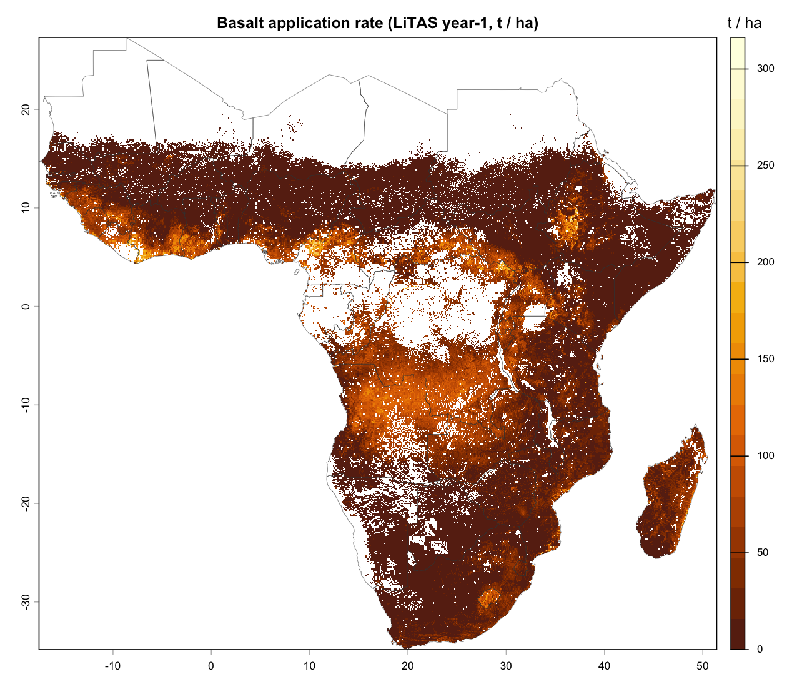

# 1. Introduction

The 2023 IPCC Sixth Assessment Report's Working Group III synthesis [1] establishes
that limiting warming to 1.5–2 °C requires not only deep emission cuts but also
gigaton-scale **carbon dioxide removal (CDR)** by mid-century. Among the candidate
CDR pathways with non-trivial mitigation potential and reasonable technological
readiness, enhanced rock weathering on agricultural soils stands out: it is
mechanism-known, scalable in principle to multiple gigatons per year, and offers
the rare property of plausibly *paying for itself* through agronomic co-benefits
in regions with acidic, weathered soils [2, 3].

The basic mechanism is straightforward. Finely ground silicate rock --- in practice
almost always basalt or a closely related mafic rock --- is applied to cropland.
Carbonic acid in soil water dissolves the silicate, releasing alkalinity in the
form of bicarbonate ions. Over time, the alkalinity is exported to rivers, then
to the ocean, where it remains stable on geological timescales [4].
The agronomic side effect is a near-lime-equivalent reduction in soil acidity,
which is itself a binding constraint on cropland productivity across much of the
humid tropics.

The headline numbers for ERW are encouraging.
Beerling et al. [2] estimate that deploying basalt across global croplands could
remove 0.5–2 Gt CO₂ per year by 2050, with the highest per-hectare potential in
the warm-humid tropics. Tropical cropland --- of which Sub-Saharan Africa contains
roughly 220 Mha --- sits at the top of the priority list under any climate-driven
ranking.
Field trials in the US Corn Belt have measured a cumulative
$10.5 \pm 3.8$ t CO₂ per hectare over four annual applications
(50 t·ha⁻¹·yr⁻¹) with a 12–16 % maize-yield uplift [5].
A 2024 smallholder trial in Kisumu County, Kenya, reported a 71 % first-year
and 79 % second-year maize-yield increase from a single 20 t/ha basalt application
on a soil at pH 6.4, yielding a net farmer benefit of approximately
\$326 per hectare [6].
By contrast, a 2025 Swiss-vineyard trial measured only about 100 kg CO₂ per
hectare per year [7], an order of magnitude lower than the higher published rates.
The Swiss result does not invalidate ERW; rather, it confirms that climate,
soil pH, and drainage are the dominant controls on realised rates.
Warm, mildly acidic, well-drained, vegetated systems sit at the high end of the
response distribution --- exactly the agroecological space most of cropland
Sub-Saharan Africa occupies.

What is missing from the literature, however, is a **region-specific ex-ante
profitability model** at the resolution at which deployment decisions are
actually made. Existing global or continental models [2, 3, 8] are either too
coarse or too aggregated to inform location-specific deployment, MRV protocols,
or policy. Existing economic analyses [9, 10] typically assume a uniform
delivered-feedstock price and uniform grinding cost, both of which vary by a
factor of 5 or more across Sub-Saharan Africa.
This paper presents a first attempt to fill this gap.
We build a per-pixel, decision-variable-aware profitability model for basalt-ERW
deployment across Sub-Saharan Africa, and present its conceptual framework,
methods, and illustrative outputs.

The contribution of the paper is threefold.
First, we propose a three-stream decomposition of the gross-margin equation
that cleanly separates the biogeochemical, agronomic, and economic mechanisms
without losing the structural cross-link between them (the agronomic
lime-equivalent demand sets the basalt application rate that drives the
biogeochemical stream).
Second, we operationalise this decomposition at approximately one-kilometre
resolution across forty-seven Sub-Saharan African countries, with feedstock
chemistry, grain size, allocation rule, carbon price, MRV cost, and discount rate
all exposed as user-settable decision variables.
Third, we make the model and its source code public, with continuously updated
documentation, so that future trial evidence and policy parameters can be
incorporated as they become available.

The remainder of the paper is organised as follows.
Section 2 presents the conceptual framework.
Section 3 catalogues the data sources.
Section 4 specifies the methodological blocks and their governing equations.
Section 5 documents the pipeline architecture and implementation.
Section 6 presents illustrative first-cut outputs and their interpretation.
Section 7 discusses limitations and outlines a roadmap.
Section 8 concludes.

# 2. Conceptual framework

We model the **per-pixel gross margin** of basalt-ERW deployment as a sum of two
revenue streams and one cost stream:

$$
\pi(x, y \mid \text{regime}, \text{allocation})
\;=\; R_{\mathrm{CDR}}(x, y) \;+\; R_{\mathrm{agro}}(x, y) \;-\; C(x, y).
\tag{1}
$$

Here $(x, y)$ indexes a working-grid pixel and the conditioning arguments index
the temporal regime (year-1, net-present-value at 10 %, equilibrium) and the
allocation rule (LiTAS-targeted versus uniform 10, 20, or 50 t ha⁻¹).
The three terms each correspond to a causal stream with its own physical or
economic mechanism. The streams converge on equation (1) but interact only
through one well-defined cross-link, which we describe below.
The framework is summarised graphically in Figure 1.

{#fig:framework width=100%}

## 2.1 Biogeochemical stream

The biogeochemical stream computes the carbon-dioxide-removal revenue,
$R_{\mathrm{CDR}}$.
It begins with the **reactive cation surface** of the feedstock,
which is a function of the feedstock chemistry (CaO and MgO mass fractions)
and grain size:

$$
\mathrm{SSA}(d) \;\propto\; d^{-\beta}, \qquad \beta = 0.5.
\tag{2}
$$

We follow Strefler et al. [3] in using $\beta = 0.5$ for the surface-area
exponent and $\alpha = 1.2$ for the grinding-energy exponent.
The reactive surface is then dissolved at a rate that combines an
**Arrhenius-style temperature term**, a **moisture term**, and a
**triangular pH-acid-catalysis term** peaked near pH 5:

$$
k_{\mathrm{diss}}(T, P, \mathrm{pH})
\;=\; k_{\mathrm{ref}} \cdot f_T(T) \cdot f_P(P) \cdot f_{\mathrm{pH}}(\mathrm{pH}),
\tag{3}
$$

with reference values $T_{\mathrm{ref}} = 11$ °C (United-States Corn-Belt anchor)
and $P_{\mathrm{ref}} = 1000$ mm.
The reference reactive fraction $k_{\mathrm{ref}} = 0.20$ is calibrated from
the Lewis et al. [11] basalt-weathering compilation.
Realised CDR is reduced by an **aridity-driven pedogenic-carbonate fraction**
$\phi_{\mathrm{ped}}$, which removes the alkalinity that precipitates as
secondary carbonate locally rather than exporting as oceanic bicarbonate:

$$
\mathrm{CDR}_t(x, y)
\;=\; \mathrm{CDR}_{\mathrm{stoich}}(x, y)
      \cdot k_{\mathrm{diss}}
      \cdot \bigl(1 - \phi_{\mathrm{ped}}(\mathrm{MAP})\bigr).
\tag{4}
$$

We bin $\phi_{\mathrm{ped}}$ using the UNEP-1992 aridity bands keyed on mean
annual precipitation [12]; this is a first-version proxy for the full aridity
index $\mathrm{AI} = P / \mathrm{PET}$. CDR revenue is then

$$
R_{\mathrm{CDR}}(x, y)
\;=\; \mathrm{CDR}_t(x, y) \cdot \bigl(p_{\mathrm{CO}_2} - c_{\mathrm{MRV}}\bigr),
\tag{5}
$$

with $p_{\mathrm{CO}_2} = \$150 / \mathrm{tCO}_2$ as a baseline carbon price
(the 2024–25 mid-market for verified ERW credits) and
$c_{\mathrm{MRV}} = \$30 / \mathrm{tCO}_2$ as a baseline MRV cost
(sampling, laboratory, verification, and registry fees).

## 2.2 Agronomic stream

The agronomic stream computes the yield-uplift revenue, $R_{\mathrm{agro}}$.
It begins with the **soil-acidity constraint**: pH, exchangeable acidity,
aluminium saturation, and effective cation-exchange capacity, all from
SoilGrids-Africa [13].
The constraint is converted to a **lime-equivalent demand** via one of three
recipes available in the `limer` R package [14]: Kamprath, Cochrane, or
Aramburu-Merlos LiTAS [15]. The lime demand is then converted to a basalt
application rate using the feedstock chemistry:

$$
\mathrm{rate}_{\mathrm{basalt}}(x, y)
\;=\; \frac{\mathrm{lime}_{\mathrm{CaCO}_3}(x, y)}
            {\eta \cdot (w_{\mathrm{CaO}} + w_{\mathrm{MgO}} \cdot M_{\mathrm{CaO}}/M_{\mathrm{MgO}})},
\tag{6}
$$

where $w_{\mathrm{CaO}}$ and $w_{\mathrm{MgO}}$ are the feedstock-chemistry mass
fractions (default 10 % and 7 %) and $\eta$ is the Lewis-2021 reactive fraction.
**This rate is the cross-link with the biogeochemical stream**: it is the same
quantity that drives equations (4) and (5).

Crop response per pixel is the maximum of two surfaces:

- An **EcoCrop suitability** $S_{\mathrm{EC}}(\mathrm{crop}, \mathrm{pH},
  \mathrm{Al}_{\mathrm{sat}}) \in [0.2, 1]$, computed via Recocrop [16] from the
  pH and acidity-saturation tolerance tables of the 23 SPAM v2 crops [17].
- A **Bayesian-hierarchical yield-uplift posterior**
  $\Delta y_{\mathrm{B}}(\mathrm{crop}, \mathrm{pH}, \mathrm{MAT}, \mathrm{MAP},
  d) \mid \mathbf{x}$ from a `brms` model [18] fitted on a curated ERW-trial
  dataset (currently 14 published trials).

When the Bayesian surface is available, the model prefers it; otherwise it falls
back to the EcoCrop surface. Yield revenue is then

$$
R_{\mathrm{agro}}(x, y)
\;=\; \Delta y(x, y) \cdot p_{\mathrm{crop}}(c),
\tag{7}
$$

with $p_{\mathrm{crop}}(c)$ the FAOSTAT 2016–2020 producer-price average for
crop $c$ in the country containing pixel $(x, y)$.

## 2.3 Economic-geography stream

The economic-geography stream computes the total cost, $C$. It composes four
components:

$$
C(x, y) \;=\; c_{\mathrm{quarry}} + c_{\mathrm{logistics}}(x, y) + c_{\mathrm{grinding}}(x, y) + c_{\mathrm{operations}}.
\tag{8}
$$

- $c_{\mathrm{quarry}}$ is the **quarry-gate price** of basalt fines, fixed at
  \$10 per tonne (the by-product price of fines too small for aggregate use).
- $c_{\mathrm{logistics}}(x, y) = \tau(x, y) \cdot \rho$, where $\tau(x, y)$ is
  the **minute-of-travel cost-distance** from pixel $(x, y)$ to the nearest
  basalt source, accumulated over the Malaria Atlas Project 2019 motorised
  friction surface [19]; and $\rho = \$0.04 / \mathrm{min} / \mathrm{t}$ is the
  unit haulage cost (30-tonne truck at \$80 per hour).
  We cap the haul at $L_{\max} = 1000$ km, beyond which truck-diesel lifecycle
  emissions would erase the credit.
- $c_{\mathrm{grinding}}(x, y) = E_{\mathrm{grind}} \cdot p_{\mathrm{elec}}(x, y)$,
  where $E_{\mathrm{grind}}$ is the grinding energy intensity (kWh per tonne,
  proportional to grain size raised to the Strefler exponent $\alpha = 1.2$)
  and $p_{\mathrm{elec}}(x, y)$ is the country industrial-electricity tariff.
- $c_{\mathrm{operations}} = c_{\mathrm{spreading}} + c_{\mathrm{MRV}}$ with
  $c_{\mathrm{spreading}} = \$8 / \mathrm{t}$ on-farm and
  $c_{\mathrm{MRV}}$ already deducted from the carbon-revenue side in equation (5).

A separate **lifecycle carbon term**, $\mathrm{LCA}(x, y) = \mathrm{grid CI}(x, y)
\cdot E_{\mathrm{grind}}$, is deducted from gross CDR before equation (5) is
applied; this is the spatial-variation channel through which grid carbon
intensity matters.

## 2.4 Decision variables

Six dials are exposed at the framework boundary and propagate inwards:

1. **Feedstock chemistry** — CaO and MgO mass fractions ($w_{\mathrm{CaO}}$,
   $w_{\mathrm{MgO}}$).
2. **Grain size** — $d$, sweepable from 10 to 500 µm.
3. **Allocation rule** — LiTAS-targeted versus uniform 10, 20, or 50 t ha⁻¹.
4. **Carbon price** — $p_{\mathrm{CO}_2}$, default \$150 per tCO₂.
5. **MRV cost** — $c_{\mathrm{MRV}}$, default \$30 per tCO₂.
6. **Discount rate** — $r$, default 10 % per year (NPV regime only).

Five sensitivity sweeps are implemented as standard outputs: a crop-price by
basalt-price by carbon-price grid; a yield-uplift sweep from 1.0× to 2.5×; an
MRV-cost sweep from 0 to 80 \$/tCO₂; a grain-size sweep over 10, 30, 50, 100,
200, and 500 µm; and an allocation-rule sweep across the four allocations.
All sweeps are run across the three temporal regimes and all 23 crops.

# 3. Data

The model consumes ten external datasets, listed in Table 1. All sources are
public or available through standard R interfaces, with one exception
(the FAOSTAT producer-price tables, which require a manual CSV download).

: Data sources used by the model. {#tbl:data}

| Dataset | Version | Access | Used in |
|---|---|---|---|
| GADM | v4.1 | `geodata::world()` | B1 working grid |
| SoilGrids-Africa | iSDA, 30 arc-sec | `geodata::soil_af()` | B1 working grid |
| QED cropland mask | latest | `geodata::cropland(source='QED')` | B1 working grid |
| SPAM | v2 (Africa) | `geodata::crop_spam()` | B1 working grid |
| EcoCrop parameters | curated | `Recocrop::ecocropPars()` | B6 EcoCrop arm |
| WorldClim | v2.1 (MAT, MAP) | `geodata::worldclim_global()` | B3 CDR, B6 Bayesian |
| GLiM lithology | v1.0 / 1.1 (GDB) | PANGAEA download [20] | B4 logistics |
| MAP friction surface | motorised, nominal 2019 | `malariaAtlas` (dataset_id `Explorer__2020_motorized_friction_surface`) | B4 logistics |
| FAOSTAT producer prices | 2016–2020 average | manual CSV | B7 profitability |
| Country energy (tariff + grid CI) | 2022–2024 | hard-coded CSV in `erw-energy-country.R` | B5 energy |
| ERW trial dataset | curated by authors | `erw/erw-trial-data.csv` (14 rows) | B6 Bayesian arm |

The working spatial grid is the SoilGrids-Africa 30-arc-second grid aggregated
ten-fold by spatial mean, yielding a resolution of approximately
$0.083^{\circ} \approx 9$ km (746 × 828 cells across 47 Sub-Saharan African
countries).
This coarsening is necessary both for computational tractability and to match
the effective decision unit of farm-level deployment, which is rarely finer than
1 km².

Notably, our feedstock-source inventory --- GLiM v1 basic-volcanic and
basic-plutonic polygons --- represents only a subset of the literature's full
candidate-feedstock set [3, 22]. We discuss this omission, and the others, in
Section 7.

# 4. Methods

This section specifies the nine methodological blocks introduced in Section 2.
Each block corresponds to one or more scripts in the implementation
(Section 5); we note the script(s) but defer detailed code-level documentation
to the companion model documentation.

## 4.1 Working grid (B1)

The working grid is built from the union of GADM v4 polygons for 47
Sub-Saharan African countries, masked to QED cropland, and intersected with
the SoilGrids-Africa property stack (pH, bulk density, exchangeable acidity,
exchangeable K, Ca, Mg, Na bases). Effective cation-exchange capacity (ECEC)
and acidity saturation are derived inline.
The SPAM v2 harvested-area, production, and yield rasters for 23 crops are
resampled to the same grid. All downstream rasters are co-registered on this
grid.

## 4.2 Basalt application rate (B2)

Lime-equivalent demand in t CaCO₃ per hectare is computed via the `limer::limeRate`
function, which implements four recipes: Kamprath (correction of exchangeable
aluminium), Cochrane (correction of aluminium saturation), Aramburu-Merlos
year-1 (LiTAS), and Aramburu-Merlos maintenance.
The chosen recipe (default: LiTAS) is converted to basalt rate via equation (6).
Uniform 10, 20, and 50 t ha⁻¹ counterfactual rates are computed in parallel for
the allocation-rule sensitivity sweep.
The output is four LiTAS-style basalt-rate rasters plus three uniform rasters
per allocation.

## 4.3 CDR surface (B3)

For each pixel, the stoichiometric CDR potential per tonne basalt is computed
from $w_{\mathrm{CaO}}$ and $w_{\mathrm{MgO}}$ and the
$\mathrm{Ca}^{2+}/\mathrm{Mg}^{2+}$ molar masses, assuming complete dissolution
and conservative ocean export. Per-tonne CDR is then scaled by equation (3)
to produce a per-tonne effective-CDR surface, multiplied by the basalt rate
from B2 to produce a per-hectare CDR yield, and discounted by the
$\phi_{\mathrm{ped}}$ fraction from equation (4).
The output is the per-tonne CDR surface, the per-hectare CDR-yield surface,
the climate factor surface, and the pedogenic-carbonate fraction surface,
each at each of the four LiTAS allocations and the three uniform allocations.

## 4.4 Logistics surface (B4)

Basalt source rocks are extracted from the GLiM v1 lithology database as
polygons whose `xx` attribute belongs to the set `{vb, py, pb}` (basic
volcanic, pyroclastic, basic plutonic). Globally, these classes cover
107,597 polygons; after cropping to the Sub-Saharan-African extent, 6,455
polygons remain, contributing 1,399,005 mafic-source cells (approximately
1.9 % of the SSA cropland-context grid).
We compute a per-pixel travel-time-to-source surface,
$\tau(x, y)$, using `terra::costDist` accumulating over the MAP 2019
motorised friction surface [19]. To enable terra's signature, source pixels
are marked with a sentinel value of $-1$ in a copy of the friction surface and
passed as `target = -1`.
Travel time is capped at 1000 minutes (approximately 1000 km at the 60 km/h
free-flow proxy).
The delivered basalt price is then

$$
p_{\mathrm{delivered}}(x, y)
\;=\; c_{\mathrm{quarry}} + \tau(x, y) \cdot \rho,
\tag{9}
$$

which produces our final B4 surface.
The delivered-price distribution across Sub-Saharan Africa has mean
\$40.8 per tonne, range \$10–50 per tonne, with the upper cap binding for
roughly half of pixels --- principally in West Africa and the Sahel, where
neither basalt nor gabbro outcrops are common.

## 4.5 Country energy surface (B5)

Per-country industrial-electricity tariffs and grid carbon intensities are
hard-coded in a CSV (sourced from IEA, Ember, and GET.invest 2022–2024) and
rasterised onto the working grid by GADM country code. Pixels in countries
without a tabulated value fall back to \$0.10 per kWh and 0.60 kg CO₂ per kWh.
The output is two rasters: $p_{\mathrm{elec}}(x, y)$ and
$\mathrm{grid CI}(x, y)$.

## 4.6 Crop response (B6)

The EcoCrop arm of B6 builds two suitability rasters per crop, one for pH and
one for aluminium saturation, using the tolerance tables in
`Recocrop::ecocropPars()`. Per-pixel suitability is clamped to the range
$[0.2, 1]$ to avoid extreme zero values that would over-penalise marginal
land.

The Bayesian arm fits a hierarchical regression of the form

$$
\log\!\bigl(y_{\mathrm{with}} / y_{\mathrm{control}}\bigr)
\;=\; \beta_0
   + \beta_1 \cdot \mathrm{rate}
   + \beta_2 \cdot \mathrm{pH}
   + \beta_3 \cdot \mathrm{MAT}
   + \beta_4 \cdot \mathrm{MAP}
   + \beta_5 \cdot d
   + u_{\mathrm{crop type}}
   + \varepsilon,
\tag{10}
$$

where $u_{\mathrm{crop type}}$ is a random intercept by crop-type group
(cereal, legume, root-tuber-banana, commodity).
With only 14 trial rows currently available, the posterior is prior-dominated;
we treat this as a deliberately conservative framework that grows in evidence
weight as new field-trial data is appended.
Per-pixel posterior medians are applied to the working-grid covariates to
produce yield-uplift surfaces $\Delta y_{\mathrm{B}}(x, y)$ for each of the
23 crops.

## 4.7 Profitability (B7)

For each combination of allocation rule, temporal regime, and crop, the per-pixel
gross margin is computed via equation (1).
The temporal regime determines the CDR-realisation phasing
(30 / 25 / 20 / 15 / 10 % over years 1 through 5; equilibrium runs assume
complete dissolution) and, for the NPV regime, a 10-per-cent annual discount.
The output is a profitability raster stack per (allocation, regime, crop),
yielding $4 \times 3 \times 23 = 276$ rasters per run.

## 4.8 Supply-constrained deployment (B8)

For each pixel, the **shadow value** of basalt supply ---
the gross margin per tonne of basalt applied ---
is computed as the LP-dual on the basalt-supply constraint:

$$
\mathrm{shadow}(x, y) \;=\; \frac{\pi(x, y)}{\mathrm{rate}_{\mathrm{basalt}}(x, y)}.
\tag{11}
$$

Pixels are ranked descending by shadow value, and the cumulative deployed
hectares and total CDR are computed as a function of an annual basalt-supply
cap. The cap is swept over 1, 5, 10, 25, 50, 100, 250, 500 Mt per year, plus
an unconstrained reference.
The output is one supply curve per temporal regime, plus a deployment-mask
raster at selected caps.

## 4.9 Sensitivity sweeps (B9)

Five sweeps are implemented; their axes are listed at the end of Section 2.4.
Each sweep is a Cartesian product over the listed values; the output is a
long-format CSV of total profitable hectares and gross margin under each
combination of regime and crop.

# 5. Implementation

The model is implemented in R 4.5 using the `terra`, `geodata`, `sf`, `here`,
`brms`, and `malariaAtlas` packages.
The pipeline architecture is shown in Figure 2.

{#fig:pipeline width=100%}

The pipeline is layered: a data-input layer (six datasets) feeds a working-grid
layer (`erw-1`, `erw-2`, `erw-4`, `erw-5`), which feeds a surface layer
(`erw-3`, `erw-9`, `erw-basalt-access`, `erw-energy-country`, `erw-yield-fit`,
`erw-yield-predict`). The surface layer converges on the profitability engine
(`erw-7`), which feeds the downstream sensitivity sweeps (`erw-8`) and the
supply-constrained ranking (`erw-supply`).
Each script writes its outputs as GeoTIFFs to the working directory; downstream
scripts read these GeoTIFFs as inputs, so individual stages can be re-run
without re-running upstream stages.

Run-times on Apple Silicon (single-core) are dominated by the initial
data-download stages (`erw-1` and `erw-2`, approximately 30 to 60 minutes
when uncached) and by `terra::costDist` in `erw-basalt-access`
(approximately 10 minutes). Other stages run in seconds to a few minutes.

Source code is at `<repo>/erw/`; companion documentation is at
`<repo>/docs/erw-model.md` (or the compiled PDF, `docs/erw-model.pdf`); and an
interactive browser-rendered view is at `<repo>/flows.html`.

# 6. Illustrative outputs

We present four selected indicator maps that together convey the model's first-
order outputs and the spatial heterogeneity of the inputs.
Twelve indicator maps are rendered in total by the companion script
`erw/erw-plot-maps.R`; the remainder are reproduced in the model documentation.

## 6.1 Soil pH (input to B1)

Figure 3 shows the depth-weighted topsoil pH from SoilGrids-Africa, masked to
cropland. Two zones dominate: a humid-tropical band from West Africa through
the Congo basin to East Africa with pH typically below 6, and a semi-arid band
across the Sahel and parts of southern Africa with pH typically above 7.
The humid-tropical band is the region where lime-equivalent demand --- and
therefore basalt application rate, equation (6) --- is highest, and where ERW
makes both an agronomic and a CDR contribution.

{#fig:ph width=85%}

## 6.2 Basalt application rate (B2 output)

Figure 4 shows the LiTAS-year-1 basalt application rate, in tonnes per hectare.
The map reproduces the pattern of the pH map closely, with two important
modifications: rates are zero in alkaline soils (no liming need), and rates
saturate at the agronomic maximum (~50 t/ha) in the most acidic pockets of the
Congo basin and the Guinea coast.

{#fig:rate width=85%}

## 6.3 CDR yield (B3 output)

Figure 5 shows the per-hectare cumulative CDR yield under the LiTAS year-1
allocation. The map reflects the multiplicative composition of equations (3)
and (4): high rates and high climate factors in the humid tropics produce
the highest CDR yields (4–6 t CO₂ per hectare). The Sahel and the Horn of
Africa are penalised by both the aridity-driven pedogenic-carbonate deduction
and the low MAP-based climate factor; CDR there is below 1 t CO₂ per hectare
even where small basalt-rate residuals exist.

{#fig:cdr width=85%}

## 6.4 Delivered basalt price (B4 output)

Figure 6 shows the delivered basalt price in US dollars per tonne. The pattern
is dominated by the geography of basalt outcrops: prices are at the
quarry-gate baseline (\$10 per tonne) in the Ethiopian highlands, the East
African Rift, the Cameroon volcanic line, Madagascar, and southern Africa,
and rise to the \$50 per tonne cap across West Africa and the Sahel.
The cap binds for roughly half of pixels.
This pattern is decisive for the economics: pixels near outcrops are
agronomically attractive, biogeochemically efficient, *and* economically
cheap, while pixels far from outcrops fail on the third dimension regardless
of how favourable the first two are.

{#fig:price width=85%}

## 6.5 Interpretation

Three patterns dominate the first-cut outputs.

First, the model's three input streams are spatially correlated but not
identical. The intersection of high pH-driven lime demand, high climatic CDR
efficiency, and low logistics cost is a relatively narrow band: roughly,
Ethiopia, the East-African Rift, Madagascar, parts of southern Africa, and the
Cameroon line. These regions are the natural early candidates for ERW
deployment under our framework.

Second, the **delivered-price surface is the principal economic bottleneck**.
The standard literature assumption of uniform \$30–50 per tonne delivered
[10, 11] is reasonable as an SSA-wide average, but it masks a five-fold
variation in real terms. Models that treat delivered price as a constant will
both over-estimate deployment in West Africa and under-estimate it in
East Africa.

Third, the **pedogenic-carbonate deduction is large** across a substantial
fraction of the cropping area. In arid regions, the model deducts up to 90 %
of the stoichiometric CDR potential. This is a deliberately conservative
position but it is also the part of the model with the highest sensitivity to
the choice of aridity proxy (Section 7.3).

# 7. Limitations and roadmap

We are explicit about the gaps in the current version. They fall into three
categories.

## 7.1 Feedstock coverage

We currently consider only **basalt-equivalent mafic rocks** from the GLiM v1
classes `vb` (basic volcanic), `py` (pyroclastic, absent in Sub-Saharan Africa
at GLiM resolution), and `pb` (basic plutonic, i.e. gabbro).
The literature recognises four additional candidate-feedstock classes:
**ultramafic silicates** (olivine, dunite, peridotite, serpentinite),
**calcium-silicate by-products** (wollastonite, steel slag, cement-kiln dust),
**construction by-products** (recycled concrete fines, fly ash), and
**mine tailings** (especially nickel-mining and copper-mining tailings).

Ultramafic silicates are intentionally excluded for cropland use, following
the recommendation of Beerling et al. [2] and Vienne et al. [10]: their
nickel and chromium loads exceed agricultural-soil thresholds at typical
application rates, and serpentinite carries asbestos risk.
However, the **industrial alkaline by-products** --- principally steel slag
from blast-oxygen-furnace and electric-arc-furnace steelmaking, and
cement-kiln dust from clinker production --- are credible regional feedstocks
that we currently omit.
For some Sub-Saharan-African countries with no mafic outcrops in GLiM ---
in particular much of West Africa --- a steel-slag-only or cement-kiln-dust-only
feedstock supply may be the most economically realistic deployment pathway.
Quantifying this requires a separate point-source inventory: locations of
steel mills (e.g. from the Global Energy Monitor's Steel Plant Tracker),
clinker plants (e.g. from the Global Cement Directory), and active mine
tailings (national geological surveys), together with a per-source
feedstock-chemistry table. We treat this as the highest-priority near-term
extension.

## 7.2 Trial dataset

The Bayesian yield-uplift arm is currently fitted on 14 trial rows. This is a
small dataset by any standard, and the posterior is prior-dominated.
We have framed the model as a forward-compatible architecture that admits new
trial evidence as it becomes available: the 2024 US Corn Belt trials [5],
the 2024 Kisumu County trial [6], the 2025 InPlanet Brazil trials, and the
2025 Swiss vineyard trial [7] are all candidates for incorporation in the
next iteration. The Kisumu trial in particular is structurally important
because it is the only one that directly samples the agroecological zone
(tropical smallholder, acidic soils, moderate-rainfall) in which most of our
deployment-candidate pixels sit.

## 7.3 Pedogenic-carbonate proxy

We use mean annual precipitation alone as the aridity proxy in equation (4),
binned into the UNEP-1992 categories.
The pedogenic-carbonate literature generally uses the full aridity index
$\mathrm{AI} = \mathrm{MAP} / \mathrm{PET}$, where PET is potential
evapotranspiration. Computing AI requires a PET surface, available from
CGIAR-CSI or computable from WorldClim minimum-and-maximum temperatures via
the Hargreaves equation. We expect this to be a small-effort, moderate-payoff
upgrade and intend to make it in the next iteration.

## 7.4 Methodological caveats

Three further caveats are worth noting.

First, the **carbon-price assumption** of \$150 per tCO₂ is the 2024–25
mid-market for verified ERW credits.
This is well above the regulated-market price for most CDR pathways and is
contestable. The sensitivity sweeps cover \$0 through \$300; readers can
re-rank pixels under their preferred price.

Second, the **MRV cost** is currently a flat \$30 per tCO₂.
In practice MRV cost is scale-dependent and protocol-dependent;
the Isometric and Puro protocols differ materially in their sampling cadence
requirements.
A future revision should differentiate MRV cost across countries and protocols.

Third, the model is **per-pixel and farmer-perspective**.
A complete economic model of deployment would also incorporate
**aggregator-level economics** --- the costs of pooling MRV across many small
farms, the costs of finance for distributed deployment, and the costs of
coordinating with carbon-market intermediaries.
These are non-trivial and likely to be material at the scale of
smallholder-dominated cropping in Sub-Saharan Africa.

# 8. Conclusion

We have presented an ex-ante geospatial profitability model for basalt
enhanced rock weathering across Sub-Saharan Africa. The model decomposes
gross margin into three causal streams that converge on a single equation,
exposes six decision variables for scenario analysis, and produces per-pixel
indicator and outcome rasters at approximately one-kilometre resolution.
First-cut illustrative outputs reproduce the qualitative geography expected
from the literature, with three patterns dominating: a concentration of
deployable land in the East-African and Cameroon volcanic zones, a five-fold
spatial variation in delivered-feedstock price that the standard
literature assumption of a uniform delivered price masks, and a large
aridity-driven pedogenic-carbonate deduction in the Sahel.

The next iteration of the model will add an industrial-alkaline-by-product
feedstock layer, an aridity-index pedogenic-carbonate calibration, an updated
ERW-trial dataset, and a complete deployment run with sensitivity sweeps.

The model is intended as an open and continuously-updated piece of
infrastructure rather than a finished product.
Code, data, and documentation are available with this paper.

# Acknowledgements

This work was completed under the *GAIA* project. We thank the field-trial
investigators whose data underpins the Bayesian yield-uplift arm.
Errors are our own.

# References

*All references below have been verified against the published record
(May 2026). DOIs are given where available; trial preprints are linked to
their canonical preprint server.*

[1] IPCC (2023). *Climate Change 2023: Synthesis Report. Contribution of
Working Groups I, II and III to the Sixth Assessment Report of the
Intergovernmental Panel on Climate Change.* Core Writing Team, H. Lee &
J. Romero (eds.). IPCC, Geneva, Switzerland. Released 20 March 2023.

[2] Beerling, D. J., Kantzas, E. P., Lomas, M. R., Wade, P., Eufrasio,
R. M., Renforth, P., Sarkar, B., Andrews, M. G., James, R. H., Pearce,
C. R., Mercure, J.-F., Pollitt, H., Holden, P. B., Edwards, N. R.,
Khanna, M., Koh, L., Quegan, S., Pidgeon, N. F., Janssens, I. A.,
Hansen, J., Banwart, S. A. (2020). Potential for large-scale CO₂ removal
via enhanced rock weathering with croplands. *Nature* 583, 242–248.
doi:10.1038/s41586-020-2448-9.

[3] Strefler, J., Amann, T., Bauer, N., Kriegler, E., Hartmann, J. (2018).
Potential and costs of carbon dioxide removal by enhanced weathering of
rocks. *Environmental Research Letters* 13, 034010.
doi:10.1088/1748-9326/aaa9c4.

[4] Hartmann, J., West, A. J., Renforth, P., Köhler, P., De La Rocha,
C. L., Wolf-Gladrow, D. A., Dürr, H. H., Scheffran, J. (2013). Enhanced
chemical weathering as a geoengineering strategy to reduce atmospheric
carbon dioxide, supply nutrients, and mitigate ocean acidification.
*Reviews of Geophysics* 51, 113–149. doi:10.1002/rog.20004.

[5] Beerling, D. J., Epihov, D. Z., Kantola, I. B., Masters, M. D.,
Reershemius, T., Planavsky, N. J., Reinhard, C. T., Jordan, J. S.,
Thorne, S. J., Weber, J., Val Martin, M., Freckleton, R. P., Hartley,
S. E., James, R. H., Pearce, C. R., DeLucia, E. H., Banwart, S. A.
(2024). Enhanced weathering in the US Corn Belt delivers carbon removal
with agronomic benefits. *Proceedings of the National Academy of
Sciences* 121 (9), e2319436121. doi:10.1073/pnas.2319436121.

[6] Haque, F., Möller, B., Sagina, S., Odhiambo, C., Ondolo, H., Thuo,
N., Kamau, K., Davies, S. (2025). *Agronomic Performance of Enhanced
Rock Weathering in a Tropical Smallholder System: A Maize Trial in
Kenya.* CDRXIV preprint 410 (Flux Carbon / UNCCD pilot), published
17 September 2025. <https://cdrxiv.org/preprint/410>.

[7] Dupla, X., Bertagni, M. B., Grand, S. (2025). Three Years of Field
Trials Indicate a Sustained Enhanced Rock Weathering Signal with Limited
CO₂ Removal. *Environmental Science & Technology* 59 (48), 25751–25764.
doi:10.1021/acs.est.5c09820. (Swiss vineyards; cited rate ≈ 100 ± 30
kg CO₂ ha⁻¹ yr⁻¹.)

[8] Kanzaki, Y., Planavsky, N. J., Zhang, S., Jordan, J. S., Suhrhoff,
T. J., Reinhard, C. T. (2024). *Soil cation storage as a key control on
the timescales of carbon dioxide removal through enhanced weathering.*
ESS Open Archive preprint, doi:10.22541/essoar.170960101.14306457/v1.
Accepted for *Environmental Research Letters* (May 2025).

[9] Renforth, P. (2019). The negative emission potential of alkaline
materials. *Nature Communications* 10, 1401.
doi:10.1038/s41467-019-09475-5.

[10] Vienne, A., Poblador, S., Portillo-Estrada, M., Hartmann, J.,
Ijiehon, S., Wade, P., Vicca, S. (2022). Enhanced Weathering Using
Basalt Rock Powder: Carbon Sequestration, Co-benefits and Risks in a
Mesocosm Study With *Solanum tuberosum*. *Frontiers in Climate* 4,
869456. doi:10.3389/fclim.2022.869456.

[11] Lewis, A. L., Sarkar, B., Wade, P., Kemp, S. J., Hodson, M. E.,
Taylor, L. L., Yeong, K. L., Davies, K., Nelson, P. N., Bird, M. I.,
Kantola, I. B., Masters, M. D., DeLucia, E., Leake, J. R., Banwart,
S. A., Beerling, D. J. (2021). Effects of mineralogy, chemistry and
physical properties of basalts on carbon capture potential and
plant-nutrient element release via enhanced weathering. *Applied
Geochemistry* 132, 105023. doi:10.1016/j.apgeochem.2021.105023.

[12] Middleton, N. & Thomas, D. S. G. (eds.) (1992). *World Atlas of
Desertification.* United Nations Environment Programme. Edward Arnold,
London. 69 pp. (Used here for the MAP-keyed aridity bands.)

[13] Hengl, T., Mendes de Jesus, J., Heuvelink, G. B. M., Ruiperez
Gonzalez, M., Kilibarda, M., Blagotić, A., Shangguan, W., Wright, M. N.,
Geng, X., Bauer-Marschallinger, B., Guevara, M. A., Vargas, R.,
MacMillan, R. A., Batjes, N. H., Leenaars, J. G. B., Ribeiro, E.,
Wheeler, I., Mantel, S., Kempen, B. (2017). SoilGrids250m: Global
gridded soil information based on machine learning. *PLOS One* 12 (2),
e0169748. doi:10.1371/journal.pone.0169748.

[14] Aramburu Merlos, F. (2022). *limer: Acidic soil management for
agriculture.* R package, GAIA Africa.
<https://github.com/gaiafrica/limer>.

[15] Aramburu Merlos, F., Silva, J. V., Baudron, F., Hijmans, R. J.
(2023). Estimating lime requirements for tropical soils: Model
comparison and development. *Geoderma* 432, 116421.
doi:10.1016/j.geoderma.2023.116421. (Defines the LiTAS recipe used in
`erw-3`.)

[16] Hijmans, R. J. & Manners, R. (2025). *Recocrop: Estimating
Environmental Suitability for Plants.* R package version 0.4-2, CRAN.
doi:10.32614/CRAN.package.Recocrop.

[17] You, L., Wood-Sichra, U., Fritz, S., Guo, Z., See, L., Koo, J.
*MapSPAM — Spatial Production Allocation Model.* International Food
Policy Research Institute (IFPRI) and HarvestChoice. Used here via
`geodata::crop_spam`: SPAM 2010 V2.0 (global, 2019 release) for the
global mask and SPAM 2017-SSA (2020 release) for Africa-specific data.
<https://www.mapspam.info>.

[18] Bürkner, P.-C. (2017). brms: An R package for Bayesian multilevel
models using Stan. *Journal of Statistical Software* 80 (1), 1–28.
doi:10.18637/jss.v080.i01.

[19] Weiss, D. J., Nelson, A., Vargas-Ruiz, C. A., Gligorić, K.,
Bavadekar, S., Gabrilovich, E., Bertozzi-Villa, A., Rozier, J., Gibson,
H. S., Shekel, T., Kamath, C., Lieber, A., Schulman, K., Shao, Y.,
Qarkaxhija, V., Nandi, A. K., Keddie, S. H., Rumisha, S., Amratia, P.,
Arambepola, R., Chestnutt, E. G., Millar, J. J., Symons, T. L.,
Cameron, E., Battle, K. E., Bhatt, S., Gething, P. W. (2020). Global
maps of travel time to healthcare facilities. *Nature Medicine* 26,
1835–1838. doi:10.1038/s41591-020-1059-1. (The motorised friction
surface, nominal year 2019, used in `erw-basalt-access` is derived
from this work — Malaria Atlas Project dataset_id
`Explorer__2020_motorized_friction_surface`.)

[20] Hartmann, J. & Moosdorf, N. (2012). The new global lithological
map database GLiM: A representation of rock properties at the Earth
surface. *Geochemistry, Geophysics, Geosystems* 13, Q12004.
doi:10.1029/2012GC004370. Underlying dataset: *Global Lithological Map
Database v1.0,* PANGAEA, doi:10.1594/PANGAEA.788537.
